# Diagramy Komunikatora Sieciowego

Wizualne przedstawienie architektury i przepływów danych w systemie.

---

## 1. Architektura Sieciowa UDP vs TCP

### UDP - Komunikacja Bezpołączeniowa

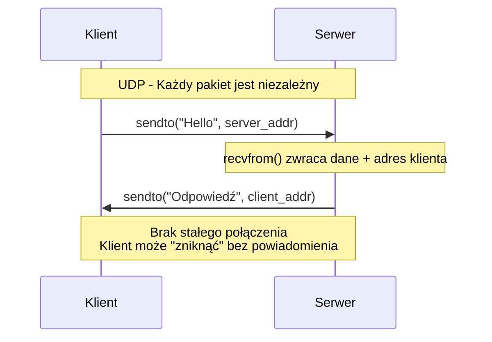

**Wyjaśnienie UDP:**

- `sendto(dane, adres)` - wysyła datagram na konkretny adres
- `recvfrom(bufor)` - odbiera datagram i zwraca adres nadawcy
- Serwer identyfikuje klienta po krotce `(IP, port)`
- Brak gwarancji dostarczenia pakietu

---

### TCP - Komunikacja Połączeniowa

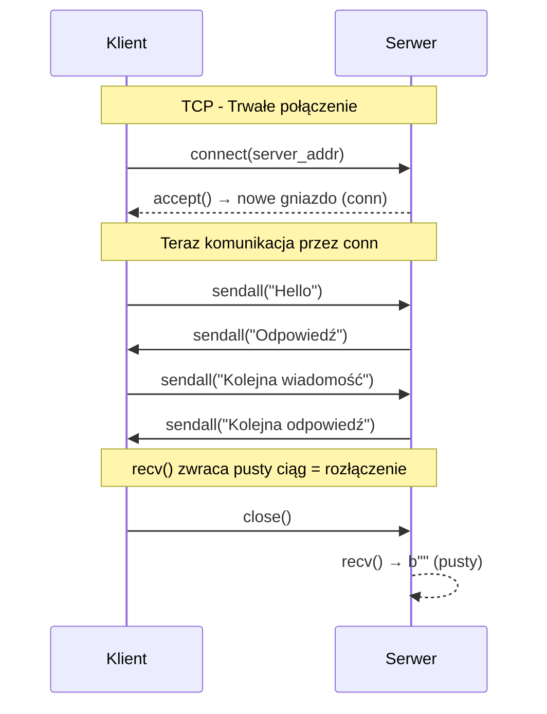

**Wyjaśnienie TCP:**

- `connect()` - nawiązuje połączenie
- `accept()` - serwer akceptuje i tworzy dedykowane gniazdo
- `sendall()` - gwarantuje wysłanie wszystkich bajtów
- `recv()` zwracający pusty ciąg oznacza rozłączenie klienta

---

## 2. Przesyłanie Plików (tylko TCP)

### Pełny Protokół Transferu Pliku

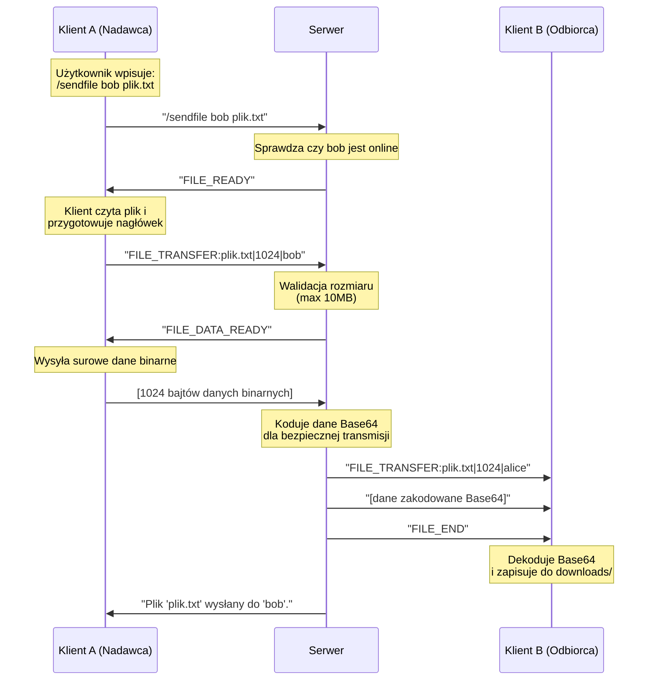

**Wyjaśnienie protokołu:**

| Krok | Wiadomość                               | Kierunek          | Opis                    |
| ---- | --------------------------------------- | ----------------- | ----------------------- |
| 1    | `/sendfile bob plik.txt`                | Klient → Serwer   | Żądanie transferu       |
| 2    | `FILE_READY`                            | Serwer → Klient   | Potwierdzenie gotowości |
| 3    | `FILE_TRANSFER:nazwa\|rozmiar\|cel`     | Klient → Serwer   | Nagłówek pliku          |
| 4    | `FILE_DATA_READY`                       | Serwer → Klient   | Gotowość na dane        |
| 5    | `[dane binarne]`                        | Klient → Serwer   | Surowe dane pliku       |
| 6    | `FILE_TRANSFER:...\n[base64]\nFILE_END` | Serwer → Odbiorca | Plik do odbiorcy        |

---

## 3. Wzorzec Żądanie/Odpowiedź

### Pobieranie Listy Użytkowników (`/list`)

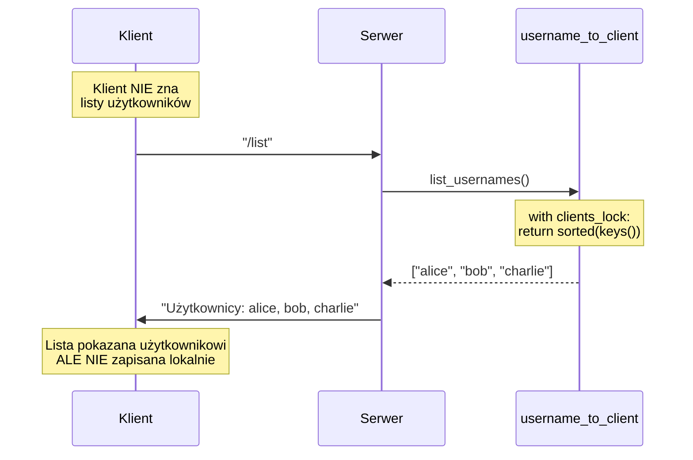

**Kluczowa zasada:** Klient **nie przechowuje** stanu. Każde żądanie `/list` wymaga odpytania serwera.

---

### Porównanie: Co klient wie automatycznie vs na żądanie

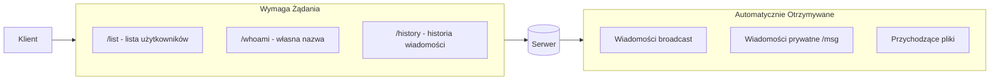

---

## 4. Broadcast do Wszystkich Klientów (TCP)

### Jak działa rozgłaszanie wiadomości

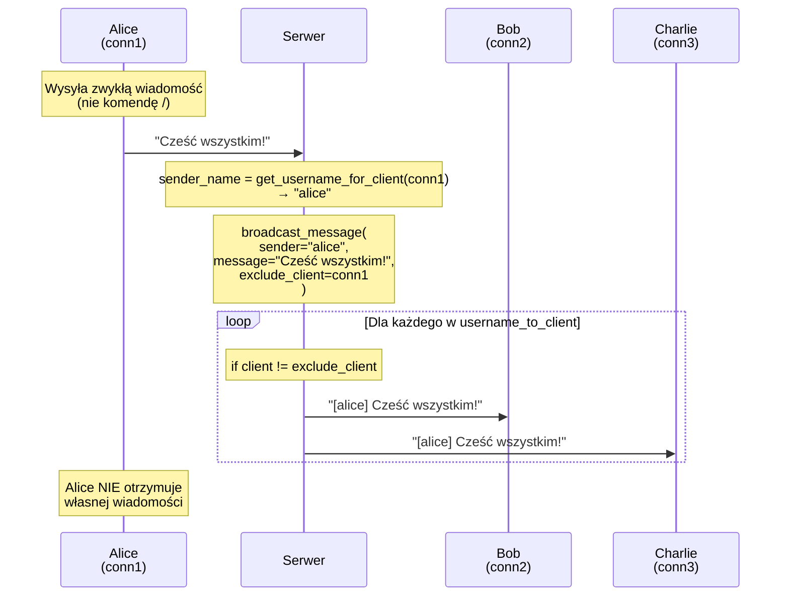

---

### Struktura Danych Klientów

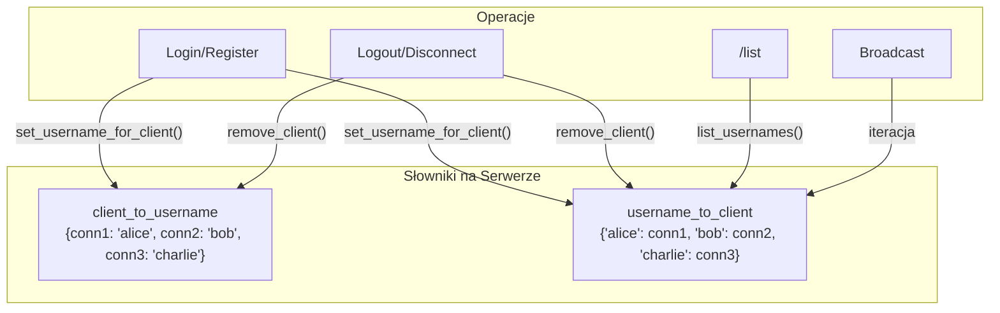

---

### Kod Broadcast - Krok po Kroku

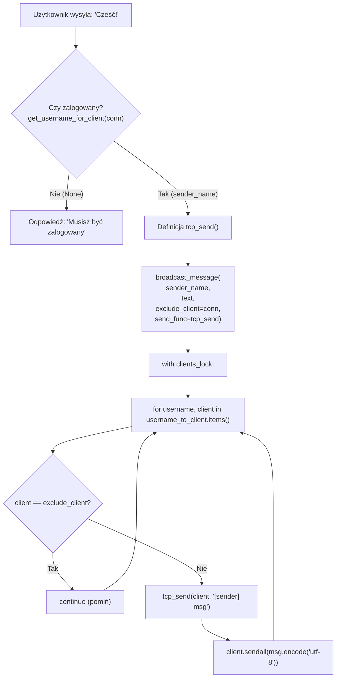

---

## 5. Różnica UDP vs TCP - Podsumowanie Wizualne

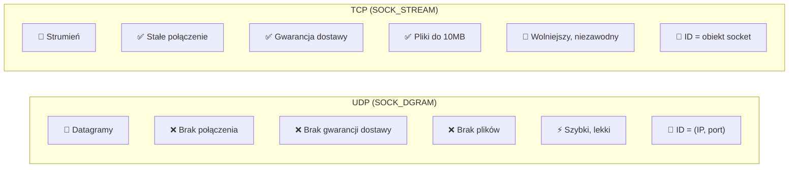

---

## 6. Cykl Życia Połączenia

### UDP

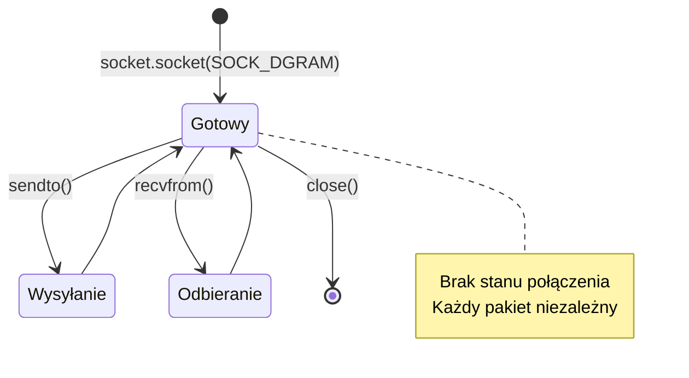

### TCP

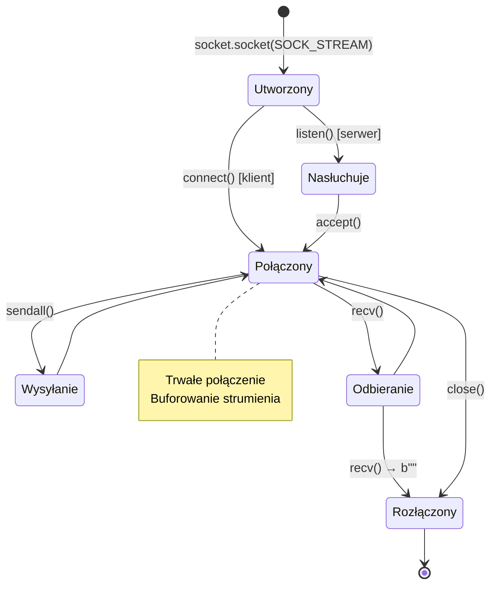

---

## Legenda Symboli

| Symbol       | Znaczenie                       |
| ------------ | ------------------------------- |
| `→`          | Jednokierunkowy przepływ danych |
| `⇄`          | Dwukierunkowy przepływ          |
| `[dane]`     | Dane binarne                    |
| `"tekst"`    | Wiadomość tekstowa              |
| `conn`       | Obiekt gniazda TCP              |
| `(IP, port)` | Adres UDP                       |
