# Diagramy Komunikatora Sieciowego

Wizualne przedstawienie architektury i przepływów danych w systemie.

---

## 1. Architektura Sieciowa UDP vs TCP

### UDP - Komunikacja Bezpołączeniowa

```mermaid
sequenceDiagram
    participant K as Klient
    participant S as Serwer

    Note over K,S: UDP - Każdy pakiet jest niezależny

    K->>S: sendto("Hello", server_addr)
    Note over S: recvfrom() zwraca dane + adres klienta
    S->>K: sendto("Odpowiedź", client_addr)

    Note over K,S: Brak stałego połączenia<br/>Klient może "zniknąć" bez powiadomienia
```

**Wyjaśnienie UDP:**

- `sendto(dane, adres)` - wysyła datagram na konkretny adres
- `recvfrom(bufor)` - odbiera datagram i zwraca adres nadawcy
- Serwer identyfikuje klienta po krotce `(IP, port)`
- Brak gwarancji dostarczenia pakietu

---

### TCP - Komunikacja Połączeniowa

```mermaid
sequenceDiagram
    participant K as Klient
    participant S as Serwer

    Note over K,S: TCP - Trwałe połączenie

    K->>S: connect(server_addr)
    S-->>K: accept() → nowe gniazdo (conn)

    Note over K,S: Teraz komunikacja przez conn

    K->>S: sendall("Hello")
    S->>K: sendall("Odpowiedź")

    K->>S: sendall("Kolejna wiadomość")
    S->>K: sendall("Kolejna odpowiedź")

    Note over K,S: recv() zwraca pusty ciąg = rozłączenie
    K->>S: close()
    S-->>S: recv() → b"" (pusty)
```

**Wyjaśnienie TCP:**

- `connect()` - nawiązuje połączenie
- `accept()` - serwer akceptuje i tworzy dedykowane gniazdo
- `sendall()` - gwarantuje wysłanie wszystkich bajtów
- `recv()` zwracający pusty ciąg oznacza rozłączenie klienta

---

## 2. Przesyłanie Plików (tylko TCP)

### Pełny Protokół Transferu Pliku

```mermaid
sequenceDiagram
    participant A as Klient A (Nadawca)
    participant S as Serwer
    participant B as Klient B (Odbiorca)

    Note over A: Użytkownik wpisuje:<br/>/sendfile bob plik.txt

    A->>S: "/sendfile bob plik.txt"

    Note over S: Sprawdza czy bob jest online
    S->>A: "FILE_READY"

    Note over A: Klient czyta plik i<br/>przygotowuje nagłówek
    A->>S: "FILE_TRANSFER:plik.txt|1024|bob"

    Note over S: Walidacja rozmiaru<br/>(max 10MB)
    S->>A: "FILE_DATA_READY"

    Note over A: Wysyła surowe dane binarne
    A->>S: [1024 bajtów danych binarnych]

    Note over S: Koduje dane Base64<br/>dla bezpiecznej transmisji

    S->>B: "FILE_TRANSFER:plik.txt|1024|alice"
    S->>B: "[dane zakodowane Base64]"
    S->>B: "FILE_END"

    Note over B: Dekoduje Base64<br/>i zapisuje do downloads/

    S->>A: "Plik 'plik.txt' wysłany do 'bob'."
```

**Wyjaśnienie protokołu:**

| Krok | Wiadomość                               | Kierunek          | Opis                    |
| ---- | --------------------------------------- | ----------------- | ----------------------- |
| 1    | `/sendfile bob plik.txt`                | Klient → Serwer   | Żądanie transferu       |
| 2    | `FILE_READY`                            | Serwer → Klient   | Potwierdzenie gotowości |
| 3    | `FILE_TRANSFER:nazwa\|rozmiar\|cel`     | Klient → Serwer   | Nagłówek pliku          |
| 4    | `FILE_DATA_READY`                       | Serwer → Klient   | Gotowość na dane        |
| 5    | `[dane binarne]`                        | Klient → Serwer   | Surowe dane pliku       |
| 6    | `FILE_TRANSFER:...\n[base64]\nFILE_END` | Serwer → Odbiorca | Plik do odbiorcy        |

---

## 3. Wzorzec Żądanie/Odpowiedź

### Pobieranie Listy Użytkowników (`/list`)

```mermaid
sequenceDiagram
    participant K as Klient
    participant S as Serwer
    participant DB as username_to_client

    Note over K: Klient NIE zna<br/>listy użytkowników

    K->>S: "/list"

    S->>DB: list_usernames()
    Note over DB: with clients_lock:<br/>return sorted(keys())
    DB-->>S: ["alice", "bob", "charlie"]

    S->>K: "Użytkownicy: alice, bob, charlie"

    Note over K: Lista pokazana użytkownikowi<br/>ALE NIE zapisana lokalnie
```

**Kluczowa zasada:** Klient **nie przechowuje** stanu. Każde żądanie `/list` wymaga odpytania serwera.

---

### Porównanie: Co klient wie automatycznie vs na żądanie

```mermaid
flowchart LR
    subgraph AUTO["Automatycznie Otrzymywane"]
        A1[Wiadomości broadcast]
        A2[Wiadomości prywatne /msg]
        A3[Przychodzące pliki]
    end

    subgraph REQUEST["Wymaga Żądania"]
        R1["/list - lista użytkowników"]
        R2["/whoami - własna nazwa"]
        R3["/history - historia wiadomości"]
    end

    SERVER[(Serwer)] --> AUTO
    CLIENT[Klient] --> REQUEST
    REQUEST --> SERVER
```

---

## 4. Broadcast do Wszystkich Klientów (TCP)

### Jak działa rozgłaszanie wiadomości

```mermaid
sequenceDiagram
    participant Alice as Alice<br/>(conn1)
    participant Server as Serwer
    participant Bob as Bob<br/>(conn2)
    participant Charlie as Charlie<br/>(conn3)

    Note over Alice: Wysyła zwykłą wiadomość<br/>(nie komendę /)

    Alice->>Server: "Cześć wszystkim!"

    Note over Server: sender_name = get_username_for_client(conn1)<br/>→ "alice"

    Note over Server: broadcast_message(<br/>  sender="alice",<br/>  message="Cześć wszystkim!",<br/>  exclude_client=conn1<br/>)

    loop Dla każdego w username_to_client
        Note over Server: if client != exclude_client
        Server->>Bob: "[alice] Cześć wszystkim!"
        Server->>Charlie: "[alice] Cześć wszystkim!"
    end

    Note over Alice: Alice NIE otrzymuje<br/>własnej wiadomości
```

---

### Struktura Danych Klientów

---

### Kod Broadcast - Krok po Kroku

```mermaid
flowchart TD
    A["Użytkownik wysyła: 'Cześć!'"] --> B{"Czy zalogowany?<br/>get_username_for_client(conn)"}

    B -->|"Nie (None)"| C["Odpowiedź: 'Musisz być zalogowany'"]
    B -->|"Tak (sender_name)"| D["Definicja tcp_send()"]

    D --> E["broadcast_message(<br/>sender_name,<br/>text,<br/>exclude_client=conn,<br/>send_func=tcp_send)"]

    E --> F["with clients_lock:"]
    F --> G["for username, client in username_to_client.items()"]

    G --> H{"client == exclude_client?"}
    H -->|"Tak"| I["continue (pomiń)"]
    H -->|"Nie"| J["tcp_send(client, '[sender] msg')"]

    J --> K["client.sendall(msg.encode('utf-8'))"]

    I --> G
    K --> G
```

---

## 5. Różnica UDP vs TCP - Podsumowanie Wizualne

```mermaid
flowchart LR
    subgraph UDP["UDP (SOCK_DGRAM)"]
        U1["📨 Datagramy"]
        U2["❌ Brak połączenia"]
        U3["❌ Brak gwarancji dostawy"]
        U4["❌ Brak plików"]
        U5["⚡ Szybki, lekki"]
        U6["🔗 ID = (IP, port)"]
    end

    subgraph TCP["TCP (SOCK_STREAM)"]
        T1["🌊 Strumień"]
        T2["✅ Stałe połączenie"]
        T3["✅ Gwarancja dostawy"]
        T4["✅ Pliki do 10MB"]
        T5["🐢 Wolniejszy, niezawodny"]
        T6["🔗 ID = obiekt socket"]
    end
```

---

## 6. Cykl Życia Połączenia

### UDP

```mermaid
stateDiagram-v2
    [*] --> Gotowy: socket.socket(SOCK_DGRAM)
    Gotowy --> Wysyłanie: sendto()
    Gotowy --> Odbieranie: recvfrom()
    Wysyłanie --> Gotowy
    Odbieranie --> Gotowy
    Gotowy --> [*]: close()

    note right of Gotowy: Brak stanu połączenia<br/>Każdy pakiet niezależny
```

### TCP

```mermaid
stateDiagram-v2
    [*] --> Utworzony: socket.socket(SOCK_STREAM)

    Utworzony --> Połączony: connect() [klient]
    Utworzony --> Nasłuchuje: listen() [serwer]

    Nasłuchuje --> Połączony: accept()

    Połączony --> Wysyłanie: sendall()
    Połączony --> Odbieranie: recv()
    Wysyłanie --> Połączony
    Odbieranie --> Połączony

    Odbieranie --> Rozłączony: recv() → b""
    Połączony --> Rozłączony: close()

    Rozłączony --> [*]

    note right of Połączony: Trwałe połączenie<br/>Buforowanie strumienia
```

---

## Legenda Symboli

| Symbol       | Znaczenie                       |
| ------------ | ------------------------------- |
| `→`          | Jednokierunkowy przepływ danych |
| `⇄`          | Dwukierunkowy przepływ          |
| `[dane]`     | Dane binarne                    |
| `"tekst"`    | Wiadomość tekstowa              |
| `conn`       | Obiekt gniazda TCP              |
| `(IP, port)` | Adres UDP                       |
